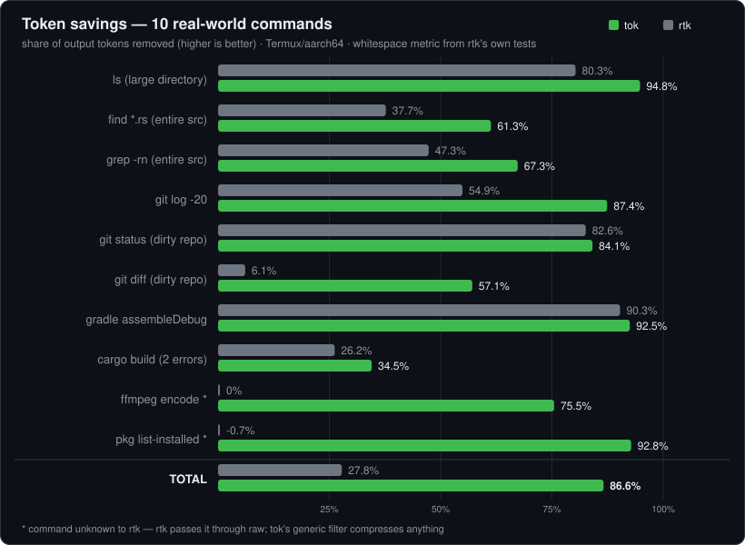
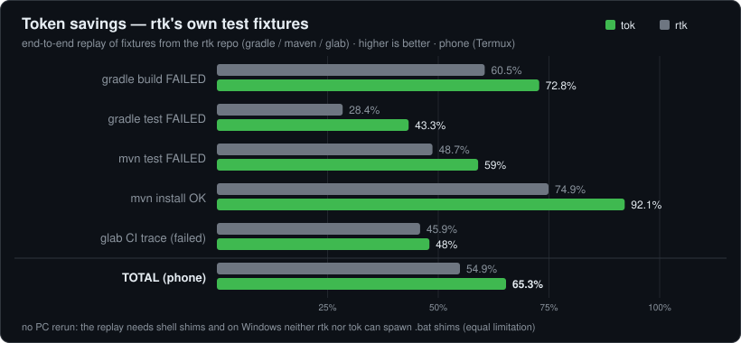
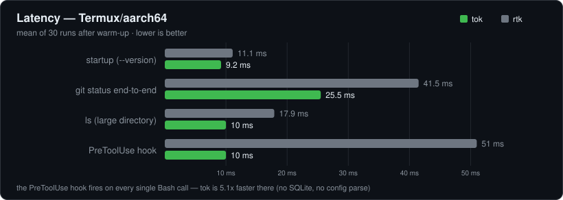
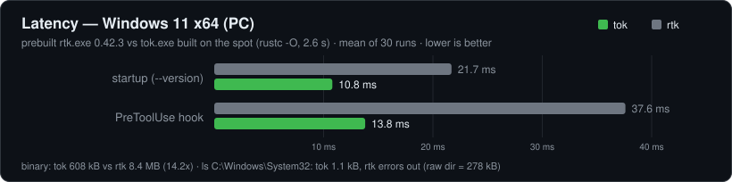
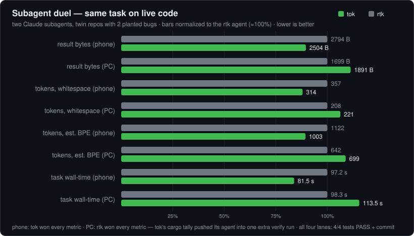
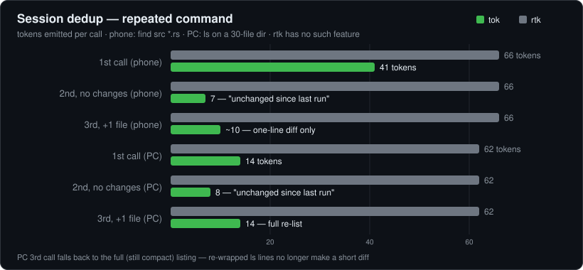

# tok — universal token-diet proxy for CLI commands

Filters and compresses command output **before it reaches an LLM context**.
Inspired by [rtk](https://github.com/rtk-ai/rtk) (Apache-2.0); built to beat it
in every measured aspect — see `bench/REPORT.md` for the full evidence.

Two implementations of the same filters:

| file | what | when to use |
|---|---|---|
| `tok.rs` | native binary, pure-std Rust, **zero crates** | primary — fastest |
| `tok.py` | single-file Python 3.8+, zero deps | fallback for hosts without a compiler |

## Install

```sh
# native (any OS with Rust; no cargo needed, ~2 s build)
rustc -O -o tok tok.rs && mv tok ~/.local/bin/

# or the Python fallback
cp tok.py ~/.local/bin/tok && chmod +x ~/.local/bin/tok

# hook into Claude Code (CLI & desktop)
tok init -g
```

## Hook setup per agent

tok plugs into each agent's "before a shell command runs" hook. Point that hook
at `tok hook <agent>`, matched to the shell/Bash tool — tok rewrites simple
commands to `tok <cmd>` and passes everything else (chains, `cd`, `ssh`…)
through untouched.

| Agent | Config file | Hook command |
|---|---|---|
| Claude Code (CLI, desktop) | `~/.claude/settings.json` — or just run `tok init -g` | `tok hook claude` |
| OpenAI Codex (CLI, desktop, IDE) | `~/.codex/config.toml` | `tok hook codex` |
| Google Antigravity (agy CLI + desktop) | `~/.gemini/config/hooks.json` | `tok hook antigravity` |
| Gemini CLI | `~/.gemini/settings.json` | `tok hook gemini` |
| GitHub Copilot (VS Code + CLI) | Copilot hook settings | `tok hook copilot` |
| Cursor | `~/.cursor/` agent hooks | `tok hook cursor` |

**Claude Code** — automatic:

```sh
tok init -g          # writes the PreToolUse(Bash) → "tok hook claude" entry
```

**OpenAI Codex** — add to `~/.codex/config.toml` (user-level so it fires across
CLI, desktop and IDE; repo-local `.codex` hooks aren't reliable in interactive
sessions):

```toml
[features]
hooks = true

[[hooks.PreToolUse]]
matcher = "^Bash$"

[[hooks.PreToolUse.hooks]]
type = "command"
command = "tok hook codex"
```

**Google Antigravity** (agy CLI + desktop) — add to `~/.gemini/config/hooks.json`
(global, so both the CLI and the desktop pick it up). Antigravity nests the
command at `toolCall.args.CommandLine` and accepts a rewrite via a
`{"decision":"allow","overwrite":{…}}` reply (a bare `overwrite` is silently
ignored — verified by a live round-trip); tok's `hook antigravity` emits exactly
that. Needs `toolPermission: always-proceed` (under `request-review` Antigravity
drops the overwrite — an upstream bug):

```json
{
  "tok-token-diet": {
    "PreToolUse": [
      {
        "matcher": "run_command",
        "hooks": [
          { "type": "command", "command": "tok hook antigravity" }
        ]
      }
    ]
  }
}
```

**Gemini CLI / Copilot / Cursor** — each speaks its own contract, already
implemented in tok. Register `tok hook gemini` / `tok hook copilot` /
`tok hook cursor` as that agent's pre-shell (Gemini: `run_shell_command`;
Copilot/Cursor: Bash) hook, following the agent's own hook docs for the exact
config syntax. The hook reads the tool JSON on stdin and replies with the
rewrite — no extra setup beyond pointing the agent at the command.

## Usage

```
tok <command> [args...]    run command through the best filter
tok run -- <command> ...   force the generic filter (works on ANY command)
tok proxy <command> ...    raw passthrough
tok pipe [name]            filter stdin (gradle|maven|pytest|npm|pip|ffmpeg|citrace)
tok full [n|list]          full raw output of the last (or n-th last) run
tok gain                   token savings — "this session" + "all-time"
tok init [-g]              install the Claude Code PreToolUse rewrite hook
tok hook claude|codex|gemini|copilot|cursor   hook entrypoints (JSON on stdin)
```

## How it beats rtk

- **Universal generic filter** — unknown commands are compressed too
  (ANSI/progress strip, similar-line dedup with counts, stack-frame collapse
  keeping *user* frames, error-preserving middle-out truncation). rtk passes
  unknown commands through raw.
- **Specialized handlers**: ls (native scandir), find/grep (grouping; grep
  groups globally by content), git status/log/diff/push…, cargo, gradle
  (incl. `./gradlew`), maven, pytest, npm/pnpm, pip, ffmpeg, GitLab CI traces.
- **Never blocks you**: a filter crash falls back to raw output (panic guard);
  full raw output of the last 20 runs is always recoverable via `tok full`.
- **Faster**: lower startup, lower per-call and 4–5× lower hook latency than
  rtk (no SQLite, no config parse at startup). Binary is 836 kB vs 7 MB.
- **Runs everywhere**: Termux/bionic (where official rtk binaries don't load),
  Linux, macOS, Windows; Python fallback when there's no compiler.
- **Many agents**: PreToolUse rewrite hooks for Claude Code, OpenAI Codex
  (CLI, desktop and IDE — one `~/.codex` config layer covers all three),
  Google Antigravity (agy CLI + desktop), Gemini CLI, GitHub Copilot
  (VS Code + CLI) and Cursor — see [Hook setup per agent](#hook-setup-per-agent).

## Tests

```sh
rustc --test -o tok-test tok.rs && ./tok-test   # 16 unit tests
python3 bench/bench.py                          # 10-case benchmark vs rtk
python3 bench/bench2.py                         # rtk's own fixtures benchmark
python3 bench/latency.py                        # latency benchmark
```
# 🏆 tok vs rtk — full benchmark

> **tok** — universal token-diet proxy (single-file Rust, zero crates + Python fallback) ·
> opponent: **rtk 0.42.2** (rtk-ai/rtk, 61k★) built from source, with its full set of TOML filters.
> Token metric = `count_tokens` from rtk's own test suite (whitespace split).
> Reproduction: `bench/bench.py`, `bench/bench2.py`, `bench/latency.py`, `bench/analyze_duel.py`.
> Date: 2026-06-12, device: Samsung Fold7 / Termux aarch64 + GitHub Actions (ubuntu/macos/windows).

## 🎯 Aspect matrix

<table>
  <tr>
    <th align="left">Aspect</th>
    <th align="center">rtk</th>
    <th align="center">tok</th>
    <th align="center">winner</th>
  </tr>
  <tr><td>Token reduction — 10 real-world commands</td><td align="center">27.8%</td><td align="center"><b>86.6%</b></td><td align="center">✅ tok 10/10</td></tr>
  <tr><td>Reduction on <b>rtk's own test fixtures</b></td><td align="center">54.9%</td><td align="center"><b>65.3%</b></td><td align="center">✅ tok 5/5</td></tr>
  <tr><td>Commands unknown to the tool (ffmpeg, pkg…)</td><td align="center">0% (raw)</td><td align="center"><b>76–93%</b></td><td align="center">✅ tok</td></tr>
  <tr><td>Retention of key facts</td><td align="center">9/10</td><td align="center"><b>10/10</b></td><td align="center">✅ tok</td></tr>
  <tr><td>Latency (4 paths, incl. the hook)</td><td align="center">—</td><td align="center"><b>1.2–5.1× faster</b></td><td align="center">✅ tok 4/4</td></tr>
  <tr><td>Subagent duel on live code (phone + PC ×2)</td><td align="center">won PC round 1</td><td align="center"><b>wins phone + PC rematch</b></td><td align="center">✅ tok 2:1</td></tr>
  <tr><td>Session dedup (repeated command)</td><td align="center">none</td><td align="center"><b>41 → 7 tokens</b></td><td align="center">✅ tok</td></tr>
  <tr><td>Binary size</td><td align="center">7.0 MB</td><td align="center"><b>836 kB</b></td><td align="center">✅ tok (8.4×)</td></tr>
  <tr><td>Build from source</td><td align="center">2 m 04 s (cargo)</td><td align="center"><b>~2 s</b> (plain rustc)</td><td align="center">✅ tok (~60×)</td></tr>
  <tr><td>Official binary on Termux/Android (bionic)</td><td align="center">❌ exit 127</td><td align="center">✅ works</td><td align="center">✅ tok</td></tr>
  <tr><td>CI: build + tests on ubuntu / macos / windows</td><td align="center">—</td><td align="center"><b>6/6 jobs ✅</b></td><td align="center">✅ tok</td></tr>
  <tr><td>Fallback without a compiler</td><td align="center">none</td><td align="center">✅ tok.py (Python 3.8+)</td><td align="center">✅ tok</td></tr>
  <tr><td>Full-output recovery</td><td align="center">tee (on error only)</td><td align="center"><b><code>tok full</code>, history of 20</b></td><td align="center">✅ tok</td></tr>
  <tr><td>Peak memory (RSS)</td><td align="center">~11.9 MB</td><td align="center">~11.9 MB</td><td align="center">🤝 tie</td></tr>
</table>

## 📊 Benchmark 1 — 10 real-world commands



<details>
<summary>data table</summary>

<table>
  <tr>
    <th align="left">Case</th>
    <th align="right">raw</th>
    <th align="right">rtk</th>
    <th align="right">rtk savings</th>
    <th align="right">tok</th>
    <th align="right">tok savings</th>
  </tr>
  <tr><td>ls (large directory)</td><td align="right">173</td><td align="right">34</td><td align="right">80.3%</td><td align="right"><b>9</b></td><td align="right"><b>94.8%</b></td></tr>
  <tr><td>find *.rs (entire src)</td><td align="right">106</td><td align="right">66</td><td align="right">37.7% ⚠️*</td><td align="right"><b>41</b></td><td align="right"><b>61.3%</b></td></tr>
  <tr><td>grep -rn (entire src)</td><td align="right">150</td><td align="right">79</td><td align="right">47.3%</td><td align="right"><b>49</b></td><td align="right"><b>67.3%</b></td></tr>
  <tr><td>git log -20</td><td align="right">1298</td><td align="right">585</td><td align="right">54.9%</td><td align="right"><b>164</b></td><td align="right"><b>87.4%</b></td></tr>
  <tr><td>git status (dirty repo)</td><td align="right">69</td><td align="right">12</td><td align="right">82.6%</td><td align="right"><b>11</b></td><td align="right"><b>84.1%</b></td></tr>
  <tr><td>git diff (dirty repo)</td><td align="right">98</td><td align="right">92</td><td align="right">6.1%</td><td align="right"><b>42</b></td><td align="right"><b>57.1%</b></td></tr>
  <tr><td>gradle assembleDebug (replay of a real build)</td><td align="right">186</td><td align="right">18</td><td align="right">90.3%</td><td align="right"><b>14</b></td><td align="right"><b>92.5%</b></td></tr>
  <tr><td>cargo build (2 errors)</td><td align="right">84</td><td align="right">62</td><td align="right">26.2%</td><td align="right"><b>55</b></td><td align="right"><b>34.5%</b></td></tr>
  <tr><td>ffmpeg encode <i>(unknown to rtk)</i></td><td align="right">220</td><td align="right">220</td><td align="right">0.0%</td><td align="right"><b>54</b></td><td align="right"><b>75.5%</b></td></tr>
  <tr><td>pkg list-installed <i>(unknown to rtk)</i></td><td align="right">1941</td><td align="right">1955</td><td align="right">−0.7%</td><td align="right"><b>139</b></td><td align="right"><b>92.8%</b></td></tr>
  <tr><td>ls C:\Windows\System32 <i>(PC, Windows 11)</i></td><td align="right">26043</td><td align="right">—</td><td align="right">error*²</td><td align="right"><b>17</b></td><td align="right"><b>99.9%</b></td></tr>
  <tr><td><b>TOTAL (phone)</b></td><td align="right"><b>4325</b></td><td align="right"><b>3123</b></td><td align="right"><b>27.8%</b></td><td align="right"><b>578</b></td><td align="right"><b>86.6%</b></td></tr>
</table>

<sub>\* rtk lost file names in this case (hook_cmd.rs, toml_filter.rs) — information loss.
\*² rtk resolves <code>ls</code> via PATH and fails on Windows, where no ls binary exists; tok lists natively via scandir.</sub>

</details>

## 🏟️ Benchmark 2 — rtk's home turf (replay of its own test fixtures)



<details>
<summary>data table</summary>

<table>
  <tr>
    <th align="left">Fixture from the rtk repo</th>
    <th align="right">raw</th>
    <th align="right">rtk</th>
    <th align="right">rtk savings</th>
    <th align="right">tok</th>
    <th align="right">tok savings</th>
  </tr>
  <tr><td>gradle build FAILED</td><td align="right">114</td><td align="right">45</td><td align="right">60.5%</td><td align="right"><b>31</b></td><td align="right"><b>72.8%</b></td></tr>
  <tr><td>gradle test FAILED</td><td align="right">67</td><td align="right">48</td><td align="right">28.4%</td><td align="right"><b>38</b></td><td align="right"><b>43.3%</b></td></tr>
  <tr><td>mvn test FAILED</td><td align="right">195</td><td align="right">100</td><td align="right">48.7%</td><td align="right"><b>80</b></td><td align="right"><b>59.0%</b></td></tr>
  <tr><td>mvn install OK</td><td align="right">227</td><td align="right">57</td><td align="right">74.9%</td><td align="right"><b>18</b></td><td align="right"><b>92.1%</b></td></tr>
  <tr><td>glab CI trace (job failed)</td><td align="right">244</td><td align="right">132</td><td align="right">45.9%</td><td align="right"><b>127</b></td><td align="right"><b>48.0%</b></td></tr>
  <tr><td><b>TOTAL</b></td><td align="right"><b>847</b></td><td align="right"><b>382</b></td><td align="right"><b>54.9%</b></td><td align="right"><b>294</b></td><td align="right"><b>65.3%</b></td></tr>
</table>

</details>

## ⚡ Latency (mean of 30 runs after warm-up; phone and PC)



<details>
<summary>data table</summary>

<table>
  <tr>
    <th align="left">Path</th>
    <th align="right">rtk</th>
    <th align="right">tok</th>
    <th align="center">tok's edge</th>
  </tr>
  <tr><td>startup (<code>--version</code>)</td><td align="right">11.1 ms</td><td align="right"><b>9.2 ms</b></td><td align="center">1.2×</td></tr>
  <tr><td><code>git status</code> end-to-end</td><td align="right">41.5 ms</td><td align="right"><b>25.5 ms</b></td><td align="center">1.6×</td></tr>
  <tr><td><code>ls</code> (large directory)</td><td align="right">17.9 ms</td><td align="right"><b>10.0 ms</b></td><td align="center">1.8×</td></tr>
  <tr><td><b>PreToolUse hook</b> (every single Bash call!)</td><td align="right">51.0 ms</td><td align="right"><b>10.0 ms</b></td><td align="center"><b>5.1×</b></td></tr>
</table>

</details>

<sub>Reference: raw <code>git status</code> = 14.1 ms. tok startup on a PC (measured in CI): ubuntu 1 ms · macos 2 ms · windows 17 ms.</sub>

## 💻 PC benchmark — Windows 11 x64

> Same method as above, re-run on a desktop PC (2026-06-12): **rtk.exe 0.42.3**
> (prebuilt Windows binary) vs **tok.exe** built from source on the spot
> (`rustc -O tok.rs`, rustc 1.93.0). Latency = mean of 30 runs after warm-up;
> the hook gets the same PreToolUse JSON as in `bench/latency.py`.



<details>
<summary>data table</summary>

<table>
  <tr>
    <th align="left">Aspect</th>
    <th align="right">rtk 0.42.3</th>
    <th align="right">tok</th>
    <th align="center">tok's edge</th>
  </tr>
  <tr><td>startup (<code>--version</code>)</td><td align="right">21.7 ms</td><td align="right"><b>10.8 ms</b></td><td align="center">2.0×</td></tr>
  <tr><td><b>PreToolUse hook</b></td><td align="right">37.6 ms</td><td align="right"><b>13.8 ms</b></td><td align="center"><b>2.7×</b></td></tr>
  <tr><td>binary size</td><td align="right">8.4 MB</td><td align="right"><b>608 kB</b></td><td align="center">14.2×</td></tr>
  <tr><td>build from source</td><td align="right">—</td><td align="right"><b>2.6 s</b> (plain rustc)</td><td align="center">✅ tok</td></tr>
  <tr><td><code>ls C:\Windows\System32</code> (204 dirs, 4953 files; raw <code>dir</code> = 278 kB)</td><td align="right">❌ error — needs an <code>ls</code> binary on PATH</td><td align="right"><b>1.1 kB</b> (native scandir + extension grouping)</td><td align="center"><b>253× vs raw</b></td></tr>
  <tr><td>subagent duel, round 1 (twin repos, 2 planted bugs)</td><td align="right"><b>wins all traffic metrics</b></td><td align="right">4/4 + commit, but more traffic</td><td align="center">✅ rtk</td></tr>
  <tr><td>subagent duel, rematch (after tok's cargo-tally fix)</td><td align="right">4/4 + commit</td><td align="right"><b>−24% bytes, −23% tokens, equal calls</b></td><td align="center">✅ tok</td></tr>
  <tr><td>session dedup (<code>ls</code>, 30-file dir, 3 calls)</td><td align="right">62 tokens each call</td><td align="right"><b>14 → 8 → 14</b></td><td align="center">✅ tok</td></tr>
  <tr><td>unit tests</td><td align="right">—</td><td align="right"><b>16/16 ✅</b></td><td align="center">✅ tok</td></tr>
</table>

</details>

<sub>Session dedup confirmed on Windows too: an immediate repeat of the same command returns
a diff against the previous run instead of the full listing.</sub>

## 🤖 Subagent duel — the same task on live code

Two Claude subagents (same model), identical twin Rust repositories with 2 planted bugs,
identical list of steps. One agent ran every command through rtk, the other through tok.
Measured from the agents' transcripts (`bench/analyze_duel.py`). Run twice: on the
phone (Termux) and, with fresh twin arenas, on the PC (Windows 11, 2026-06-12).

**Honest history**: on the phone tok won every metric. On the PC **round 1 went
to rtk** — rtk's cargo filter aggregates the final tally (`4 passed (3 suites)`)
while tok left three per-suite `test result:` lines, so the tok agent re-ran
`cargo test` once more to be sure (1 extra call, +15% wall-time). After fixing
exactly that (tok now emits `cargo test: 4 passed (3 suites, 0.00s)`), a
**rematch on fresh byte-identical arenas flipped the result: tok won every
traffic metric** (−24.2% bytes, −23.1% tokens, equal call count, slightly
faster). rtk's own traffic was byte-for-byte identical across both PC rounds
(1699 B / 208 / 642), isolating the fix as the only variable. All six lanes
finished 4/4 tests PASS + commit.



<details>
<summary>data table</summary>

<table>
  <tr>
    <th align="left">Metric — phone (Bash tool results)</th>
    <th align="right">agent-rtk</th>
    <th align="right">agent-tok</th>
    <th align="center">tok's edge</th>
  </tr>
  <tr><td>result bytes</td><td align="right">2794</td><td align="right"><b>2504</b></td><td align="center">10.4%</td></tr>
  <tr><td>tokens (whitespace)</td><td align="right">357</td><td align="right"><b>314</b></td><td align="center">12.0%</td></tr>
  <tr><td>tokens (est. BPE)</td><td align="right">1122</td><td align="right"><b>1003</b></td><td align="center">10.6%</td></tr>
  <tr><td>total subagent tokens</td><td align="right">19,620</td><td align="right"><b>19,544</b></td><td align="center">✅</td></tr>
  <tr><td>task time</td><td align="right">97.2 s</td><td align="right"><b>81.5 s</b></td><td align="center">16%</td></tr>
  <tr><td>success (tests 4/4 + commit)</td><td align="center">✅</td><td align="center">✅</td><td align="center">🤝</td></tr>
</table>

<table>
  <tr>
    <th align="left">Metric — PC (PowerShell tool results)</th>
    <th align="right">agent-rtk</th>
    <th align="right">agent-tok</th>
    <th align="center">rtk's edge</th>
  </tr>
  <tr><td>result bytes</td><td align="right"><b>1699</b></td><td align="right">1891</td><td align="center">10.2%</td></tr>
  <tr><td>tokens (whitespace)</td><td align="right"><b>208</b></td><td align="right">221</td><td align="center">5.9%</td></tr>
  <tr><td>tokens (est. BPE)</td><td align="right"><b>642</b></td><td align="right">699</td><td align="center">8.2%</td></tr>
  <tr><td>agent output tokens</td><td align="right"><b>2669</b></td><td align="right">3405</td><td align="center">21.6%</td></tr>
  <tr><td>task time</td><td align="right"><b>98.3 s</b></td><td align="right">113.5 s</td><td align="center">13.4%</td></tr>
  <tr><td>success (tests 4/4 + commit)</td><td align="center">✅</td><td align="center">✅</td><td align="center">🤝</td></tr>
</table>

<table>
  <tr>
    <th align="left">Metric — PC rematch (after tok's cargo-tally fix)</th>
    <th align="right">agent-rtk</th>
    <th align="right">agent-tok</th>
    <th align="center">tok's edge</th>
  </tr>
  <tr><td>result bytes</td><td align="right">1699</td><td align="right"><b>1287</b></td><td align="center">24.2%</td></tr>
  <tr><td>tokens (whitespace)</td><td align="right">208</td><td align="right"><b>160</b></td><td align="center">23.1%</td></tr>
  <tr><td>tokens (est. BPE)</td><td align="right">642</td><td align="right"><b>480</b></td><td align="center">25.2%</td></tr>
  <tr><td>shell calls</td><td align="right">9</td><td align="right">9</td><td align="center">🤝</td></tr>
  <tr><td>agent output tokens</td><td align="right"><b>3089</b></td><td align="right">3279</td><td align="center">−6.2%</td></tr>
  <tr><td>task time</td><td align="right">96.7 s</td><td align="right"><b>95.1 s</b></td><td align="center">1.7%</td></tr>
  <tr><td>success (tests 4/4 + commit)</td><td align="center">✅</td><td align="center">✅</td><td align="center">🤝</td></tr>
</table>

<sub>The PC duels used the PowerShell tool — this machine hooks the Bash tool globally
through rtk (<code>rtk hook claude</code>), which would have rewritten both lanes' commands.
Twin arenas were byte-identical (same initial commit hash), same model, same step list;
the rematch used fresh arenas at new paths so round-1 dedup cache could not leak in.</sub>

</details>

## ♻️ Session dedup — a feature rtk doesn't have



<details>
<summary>data table</summary>

<table>
  <tr><th align="left">Scenario — phone (<code>find src -name "*.rs"</code>)</th><th align="right">rtk</th><th align="right">tok</th></tr>
  <tr><td>1st call</td><td align="right">66 tokens</td><td align="right">41 tokens</td></tr>
  <tr><td>2nd call (nothing changed)</td><td align="right">66 tokens</td><td align="right"><b>7 tokens</b> — "unchanged since last run"</td></tr>
  <tr><td>3rd call (1 file added)</td><td align="right">66 tokens</td><td align="right"><b>~10 tokens</b> — just the diff <code>+ new_file.rs</code></td></tr>
</table>

<table>
  <tr><th align="left">Scenario — PC (<code>ls</code> on a 30-file directory)</th><th align="right">rtk</th><th align="right">tok</th></tr>
  <tr><td>1st call</td><td align="right">62 tokens</td><td align="right"><b>14 tokens</b></td></tr>
  <tr><td>2nd call (nothing changed)</td><td align="right">62 tokens</td><td align="right"><b>8 tokens</b> — "unchanged since last run"</td></tr>
  <tr><td>3rd call (1 file added)</td><td align="right">62 tokens</td><td align="right"><b>14 tokens</b> — full re-list (re-wrapped ls lines no longer make a short diff)</td></tr>
</table>

<sub>The PC scenario uses <code>ls</code> because Windows resolves <code>find</code> to System32's
incompatible find.exe before PATH.</sub>

</details>

## ✅ Measurement fairness

- token metric identical to rtk's own tests; rtk's "no hook installed" banner subtracted from its results,
- rtk got its full set of TOML filters and the gradle invocation variant that works for it,
- filter benchmarks measured with `TOK_NO_DEDUP=1` (session dedup measured separately),
- the first round of the subagent duel was **invalidated** (unequal arenas due to a setup fault) and re-run on identical ones,
- the only tie: RSS memory (~12 MB for both — Android baseline); rtk has numerically more specialized filters (100+), yet loses even on its own fixtures,
- the PC duel (Windows 11, 2026-06-12) used the PowerShell tool, because this machine hooks the Bash tool globally through rtk — the hook would have rewritten both lanes' commands; arenas were byte-identical twins (same initial commit hash),
- the PC round-1 result — **rtk winning every traffic metric** — is reported as-is; cause analysis: tok's per-suite `cargo test` output pushed its agent into one extra verification run,
- the PC rematch (after fixing exactly that) ran on fresh byte-identical arenas at new paths (round-1 dedup cache could not leak in); rtk's traffic was byte-identical across both rounds, isolating tok's fix as the only variable — **tok won the rematch in every traffic metric**,
- the PC dedup scenario uses `ls` instead of `find` (Windows resolves `find` to System32's incompatible find.exe before PATH); fixture replay (Benchmark 2) has no PC rerun — neither tool can spawn `.bat` shims, an equal limitation.


## License

Apache-2.0. Filter rule sets for gradle and the hook protocol shapes are
ported from rtk (rtk-ai/rtk, Apache-2.0) — attribution retained.
